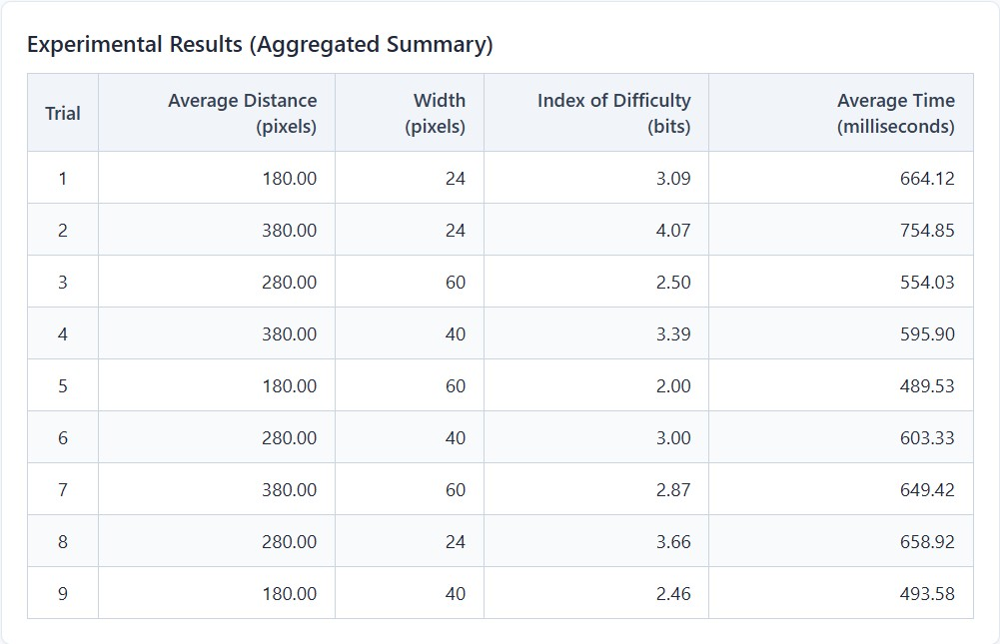
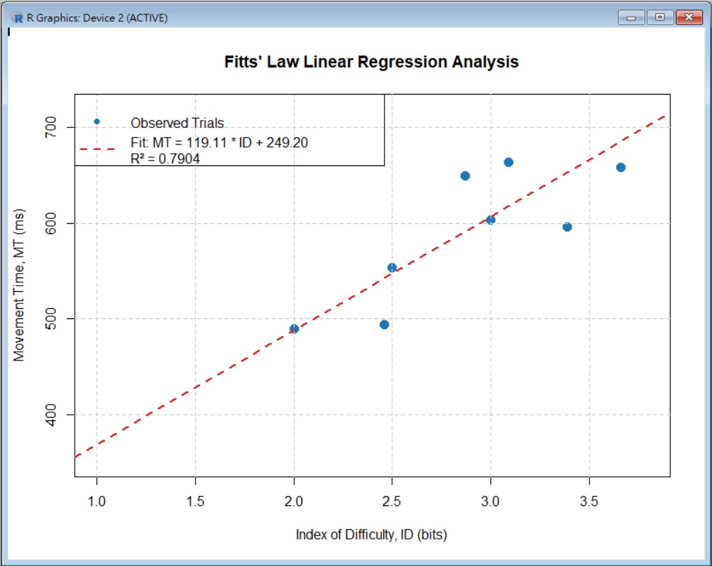

# HCI Assignment 1 (Part II): Fitts' Law Experiment
FittsLaw_part2 工工系張巧佩

> **Live Demo 網頁體驗**: [點此線上體驗實驗 App](https://peggyciao.github.io/HCI_assignment1_FittsLaw_part2_115034575/)

---

## 1. Scenario & Real-World Problem (情境與痛點)
* **Target Users**: 通勤途中單手操作智慧型手機的使用者。
* **Context & Pain Point**: 使用者一手拉吊環，僅靠單手大拇指滑動與點擊螢幕。當需要點擊位於螢幕頂端邊緣或角落（如左上角返回鍵、右上角關閉或更多選單）的微型圖示時，受限於大拇指關節運動極限與指尖遮蔽，需要耗費大量時間進行視覺閉迴路校正（Hunting Effect），極易誤觸或點擊失敗。

---

## 2. Innovation Mechanism (創新機制)
* **Dual-Corner Target Dynamic Inflation (角落目標動態膨脹)**:
  * 點擊目標分佈於螢幕左上與右上角落，模擬實際功能鍵位置。
  * 當游標/手指接近目標中心 85 px 範圍內時，目標自動放大 1.8 倍，動態擴增有效寬度 $W$。
  * 藉由在運動末期的減速階段（Deceleration Phase）調降難度指數 $ID$，有效縮短微幅修正時間。

---

## 3. Experiment Screen Recording (實驗錄影)

你可以透過以下方式觀看影片（二擇一）：
https://github.com/user-attachments/assets/4acb2068-077e-4d13-9715-a1dd5d1d842c
<!-- 方式 A：直接放連結與預覽按鈕 -->

> 點擊上方按鈕前往觀看完整實驗錄影（已設為知道連結者可看）。

---

## 4. Empirical Analysis & Fitts' Law Formula (數據分析與回歸公式)

### Regression Scatter Plot (學術散布圖)

### Custom Fitts' Law Equation
依據實驗數據進行線性回歸（$MT = a + b \cdot ID$）
，求得公式如下：
$$MT = [ 249.20] + [ 119.11] \cdot \log_2\left(\frac{A}{W} + 1\right)$$
* **$R^2$ Score**: `[ 0.7904]`
* **參數分析**:
*  $a$ 反映基礎認知與非動作反應時間，是預測movement time時間的基準；
*  $b$ 體現資訊處理耗時率，因受試者在不同情境的資訊處理時間而有差異。
*  與Part1練習實驗相比，因為不是單純的左右點擊，我所設計的目標點擊範圍也變小，造成b相對變大，也沒有那麼穩定的線性趨勢。
*  而a是基礎時間，和距離有很大的關係，這次的設計是從螢幕中心出發往角落點擊，所以數字比前實驗小。
